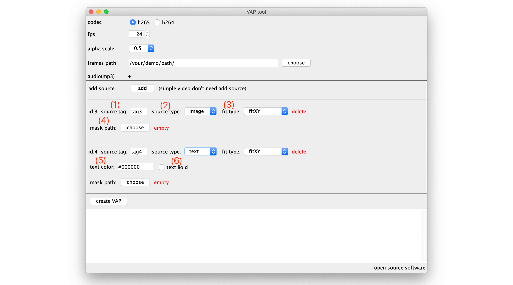

# VapTool

Version: [tool2.0.6](https://github.com/Tencent/vap/releases/tag/tool2.0.6)

Windows: [vaptool_win_v2.0.6.zip](https://github.com/Tencent/vap/releases/download/tool2.0.6/vaptool_win_v2.0.6.zip)(include JRE)
Mac: [vaptool_mac_v2.0.6.zip](https://github.com/Tencent/vap/releases/download/tool2.0.6/vaptool_mac_v2.0.6.zip)(not inclue JRE)


Preview tool：[Mac](https://github.com/Tencent/vap/releases/download/VapPreview1.2.0/vap-player_mac_1.2.0.zip), [Windows](https://github.com/Tencent/vap/releases/download/VapPreview1.2.0/vap-player_1.2.0.exe)


Demo download：[test_demo.zip](https://github.com/Tencent/vap/releases/download/tool2.0.2/test_demo.zip)

## Windows

Double-click this file to run:

```sh
win_start.bat
```

## Mac

You need to open the terminal command line, enter the tool directory and execute the following command:

Check & initialize work
```sh
// Check if java is installed first
// If there is no version information output, please install java first
java -version

// Check if the ffmpeg and mp4edit tools in the mac folder have execution permissions. If there is no permission, please grant execution permissions
./ffmpeg -version
./mp4edit -v

// Grant script executable permissions (only need to be executed once)
chmod +x mac_start.sh

```


Start the tool
```sh
./mac_start.sh
```

### Mac App Version

If you don't know how to run it on the command line, you can download the Mac App version：[vaptool_mac_app_v2.0.6.zip](https://github.com/Tencent/vap/releases/download/tool2.0.6/vaptool_mac_app_v2.0.6.zip)

Usage:

1. Double-click VapToolMac to run after decompression
2. Authorization is required for the first run (a prompt box will pop up indicating that it cannot be opened) -> System Preferences -> Security & Privacy -> General tab -> Click "Open Anyway"
3. After authorization, it can be run normally
PS: It is recommended to use the command line method. The Mac App version has some unresolved issues, such as parameter saving issues.


## Tool description


* codec: Encoding type (default h264)
 	* h264: Advantages: good compatibility, almost all machines can play; Disadvantages: compression ratio is not as high as h265;
	* h265: Advantages: higher compression ratio, clearer picture; Disadvantages: Android 4.x version cannot play, compatibility of some low-end machines is poor; Web browser may not support h265;

* fps: How many frames to play per second;
* quality: Select the clarity parameter, providing two options of bitrate/crf
	* bitrate(default): Set the video bit rate, default is 2000k, the larger the number, the clearer the video, but the file is also larger. Compared with crf, it can more accurately control the file size;
	* crf: icture quality parameter, value range [0,51] default 29 (0 means lossless compression, the file will be very large), if the clarity requirements are relatively high, you can control the crf parameter, setting a small value can significantly improve the video clarity, but the file size is not easy to control (the file will be larger).
* alpha scale: Whether to scale the video alpha area (default scale 0.5), currently optional: scale 0.5; do not scale 1. Scaling the video can ultimately reduce the video resolution and improve compatibility;
* frames path: The location where the video frames are stored
	* The video frame naming method is 000.png 001.png ... 099.png. The first frame must be 000.png otherwise it cannot be generated normally. You can refer to "simple_demo";
	* Click "choose" to pop up the folder selector, which is used to select the path of the folder where the video frames are located.
* audio: The sound file that needs to be integrated into the video (currently supports mp3 files).

Ordinary VAP videos can be generated by completing the above configuration.
 
Click "create VAP" to start generating the video.


### File output
* video.mp4: The final generated video file
* vapc.json: Web configuration file
* md5.txt: The md5 of video.mp4, which can be used for file verification
* frames: Temporary image files

## Advanced: Fusion animation
PS: Ordinary animations do not require this setting




Click the "add" button to add fusion animation mask information

1. source tag: Placeholder tag, equivalent to a string flag of the current resource. When playing the fusion animation, different bitmaps are returned according to different tags for display;

2. source type: Indicates the attribute type, currently supports two types of image (picture) and text (text);

3. fit type: The way the image is displayed. Currently, two types of fitXY (image tiling default) and centerCrop (proportional scaling) are supported. These concepts are the same as the image alignment concepts in Android;

4. mask path: Mask image path;

5. text color: If it is a text type, set the text color, format: #000000

6. text Bold: If it is a text type, set whether the text is bold

Note: Using fusion animation alpha scale will be forcibly set to 0.5 because space needs to be reserved for the mask

### Mask image description

Example:


The figure shows the mask of frame 150 in two sets of masks (1 is the avatar mask and 2 is the text mask), and 3 represents the corresponding video frame content.
Points to note:

1. Mask file naming rules, the same as video frames 000.png 001.png ... 099.png, the file name indicates which frame the current mask belongs to;

2. The size of the mask frame must be the same as the video frame;

3. Mask content: The black area indicates the position where the image (text) needs to be displayed, and the transparency of other areas must be 0 (the red in the black area indicates the occlusion area);

You can refer to "vapx_demo"

Effect picture:


## Others

Java Tool source:Android/PlayerProj: [animtool](https://github.com/Tencent/vap/tree/master/Android/PlayerProj)


## FAQ

[FAQ wiki](https://github.com/Tencent/vap/wiki/FAQ)

